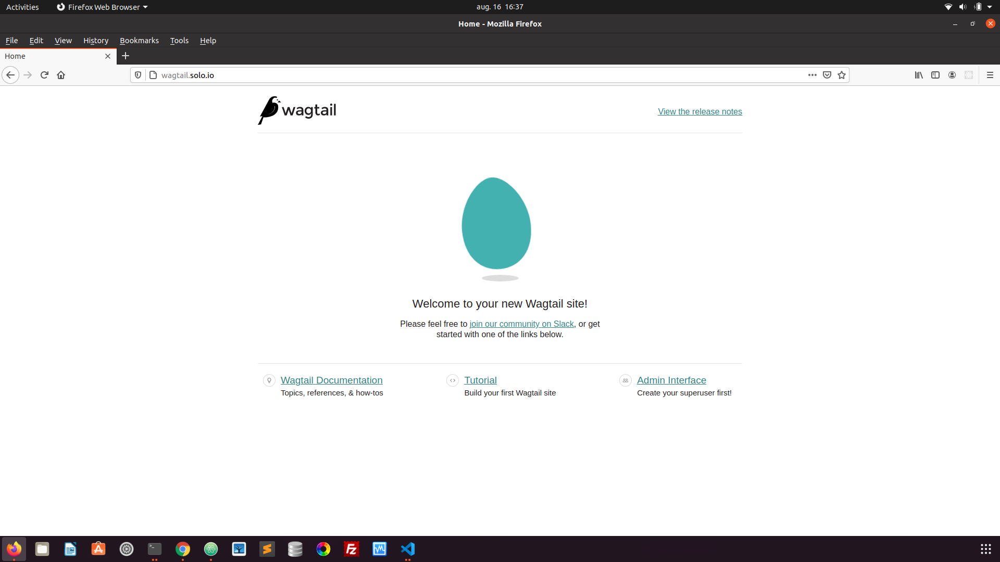
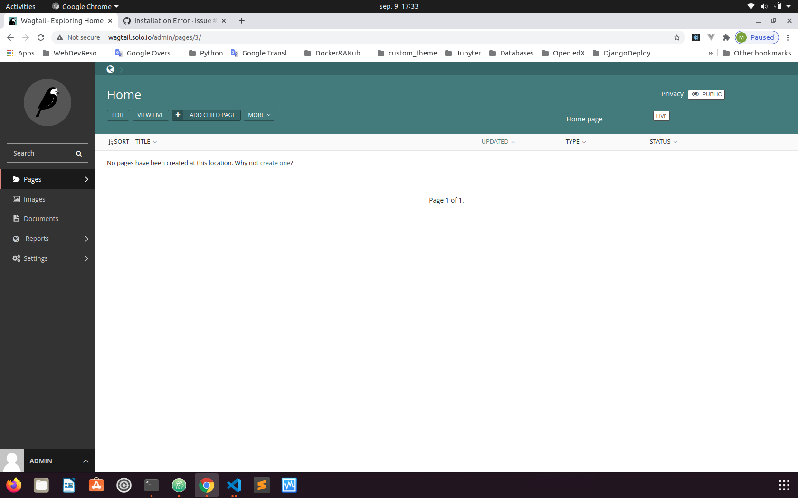

# tutor-wagtail
Wagtail Plugin for Tutor Open edX

## Installation:
If using virtualenv

`python3 -m venv ~/tutor  `

`source ~/tutor/bin/activate  `

If you using Tutor Production modus and on K8s, you have to add Wagtail subdomain to your " /etc/hosts "  file. 

Cloning and installing plugin:

`git clone https://github.com/murat-polat/tutor-wagtail   `

`cd tutor-wagtail  `

`pip3 install -e tutor-wagtail    `

`tutor plugins list  `

You should see  Wagtail plugin in your plugins list. (If it's not, please reboot your server  check it again.)

`wagtail==0.2.0   `  

`tutor plugins enable wagtail `

Building new Docker services for Tutor:

`tutor images build wagtail  `

`tutor local quickstart  `

For Kubernetes deployment run:

`tutor k8s quickstart`        http://wagtail.yourdomain/

### Customization

First of all, you must create your custom Wagtail app and push back to GitHub.
This plugin uses default  https://github.com/murat-polat/app. After your custom repo, all you need to change
Dockerfile which will point your custom repo/application

https://github.com/murat-polat/tutor-wagtail/blob/7828d2ebb52c545400d941834935399a8df1e0bd/tutor-wagtail/tutorwagtail/templates/wagtail/build/wagtail/Dockerfile#L17

Thats all :)

### Login to admin site:

Create superuser:

`tutor local run wagtail python3 manage.py createsuperuser  `

login your admin site:

http://wagtail.your_domain/admin

